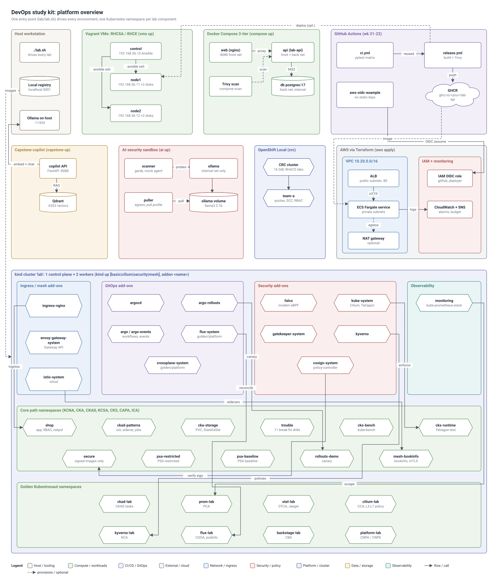

# Architecture diagrams

Diagrams of the lab kit, generated from small YAML specs by `diagram.py`. Each spec renders to three files:

| File | Use it for |
|---|---|
| `<name>.drawio` | editing in draw.io / diagrams.net, and exporting to Visio (`.vsdx`) |
| `<name>.svg` | embedding in Markdown, slides and wikis; Visio can import it too |
| `<name>.png` | quick viewing, chat and tickets (rendered at 2x) |

## Platform overview



Source: [`specs/platform-overview.yaml`](specs/platform-overview.yaml). It covers the Vagrant VMs, Docker Compose, GitHub Actions, AWS Terraform, OpenShift Local, the AI-security sandbox, the capstone copilot, and the kind cluster with its add-on namespaces and every lab namespace, grouped by track.

## Regenerate a diagram

```bash
pip install pyyaml playwright        # playwright is only needed for the PNG
python3 lab/architecture/diagram.py lab/architecture/specs/platform-overview.yaml lab/architecture/
```

- Usage: `python3 lab/architecture/diagram.py <spec.yaml> <outdir>/ [--name NAME] [--no-png]`. The output name defaults to the spec file name.
- The PNG is rendered from the SVG with Playwright's Chromium. The script uses a Chromium that is already installed (`PLAYWRIGHT_BROWSERS_PATH`, `/opt/pw-browsers` or `~/.cache/ms-playwright`) and never downloads one. If Python Playwright is missing, it tries Node Playwright; if neither is available, it skips the PNG and still writes the `.drawio` and `.svg`.
- Layout and edge routing are automatic. After you edit a spec, regenerate the diagram and check the PNG.

## Open the .drawio file

- **Desktop app:** install draw.io Desktop (https://github.com/jgraph/drawio-desktop/releases), then File > Open and pick the `.drawio` file.
- **Browser:** go to https://app.diagrams.net, then File > Open from > Device (or drag the file onto the page).
- **VS Code:** the "Draw.io Integration" extension opens `.drawio` files in the editor.

The file is an uncompressed mxfile, so it diffs cleanly in git. Groups are swimlane containers: moving a group moves its nodes. Edges are orthogonal connectors attached to their nodes.

## Get a Visio file

1. Open the `.drawio` file in draw.io (desktop or diagrams.net).
2. Choose **File > Export as > VSDX**.
3. Open the `.vsdx` in Microsoft Visio. Shapes, containers, connectors and labels stay editable.

Visio can also import the SVG (Insert > Pictures, or open the `.svg` directly; recent Visio versions can convert it to shapes). The `.vsdx` export gives a cleaner, fully editable result.

## Spec format

```yaml
title: "My system"                 # required: shown at the top
subtitle: "optional second line"
width: 1600                        # optional target canvas width in px (default 1600)

layout:                            # optional: top-level groups per row, in order
  rows:
    - [edge, app]
    - [data]

groups:
  - id: edge                       # unique id (letters, digits, - _ .)
    label: "Edge"                  # container title
    role: network                  # colour role (see below)
  - { id: app,  label: "App tier", role: compute, cols: 2 }    # cols: optional node-grid width
  - { id: jobs, label: "Workers",  role: compute, parent: app } # parent: nest inside another group
  - { id: data, label: "Data",     role: data }

nodes:
  - id: lb
    label: "Load balancer"
    sublabel: ":443"               # optional smaller grey line: port, namespace, IP ...
    group: edge                    # optional; a node without a group sits outside every container
    shape: box                     # box (default) | cylinder (data) | cloud (external) | hexagon (k8s)
  - { id: pg, label: postgres, group: data, shape: cylinder }

edges:
  - from: lb                       # node id or group id
    to: app                        # node id or group id (a group endpoint attaches to its border)
    label: "https"                 # optional
    dashed: true                   # optional: provisions / optional / async
```

Roles and their colours: `network`, `compute`, `data`, `security`, `ci`, `observability`, `external`, `platform`, `host`. An unknown role falls back to `external`, with a warning. The legend lists only the roles a spec uses.

Layout tips:
- Without `layout.rows`, top-level groups fill rows in spec order. With it, each listed row is narrowed (fewer node columns) until it fits `width`.
- Child groups sit in rows below their parent's own nodes.
- Use `cols` to shape a group's node grid.
- Keep labels short. Nodes wrap at about 200 px, and edge labels need a straight run of edge to sit on.
