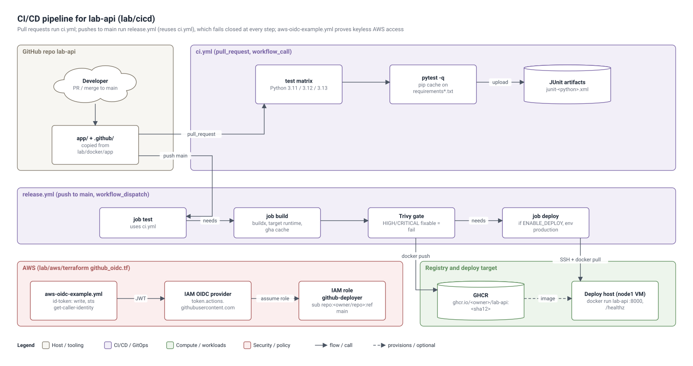

# CI/CD lab (weeks 21-22)

1. Create a GitHub repo `lab-api`. Copy `../docker/app` to `app/` and `.github/` from here.
2. Open a PR that breaks `test_add` - watch the matrix go red on all 3 Python versions, then fix it.
3. Merge to main: `release.yml` reuses `ci.yml`, builds, Trivy-scans, pushes `ghcr.io/<you>/lab-api:<sha>`.
4. Deploy: set repo variable `ENABLE_DEPLOY=true`, create environment `production` (add a required reviewer
   to practise manual approvals) and its three secrets. Target = node1 VM or any cheap VM with Docker.
5. OIDC: after Phase 11 Terraform, run `aws-oidc-example.yml` and confirm no AWS keys exist in repo secrets.

## Architecture

Editable source: `lab/architecture/cicd-pipeline.drawio` (open in draw.io / diagrams.net; File > Export as > VSDX gives a Visio file).

Failure-to-fix table to fill as you go:

| Symptom | Cause | Fix |
|---|---|---|
| `denied: permission_denied` pushing to GHCR | workflow token lacks packages:write | add `permissions: packages: write` to the job |
| cache never hits | cache key path wrong | `cache-dependency-path` must match the requirements files |
| | | |
