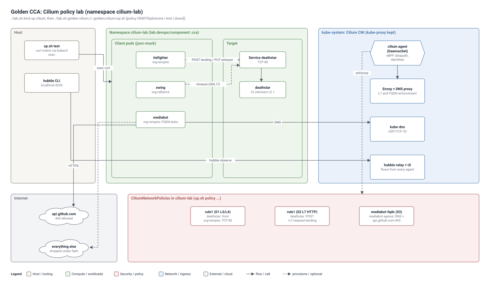

# CCA lab - Cilium (Golden track G4)

Guide: [`study-guides/24-cca-cilium.md`](../../../study-guides/24-cca-cilium.md) · Namespace: `cilium-lab` (label `lab.devops/component: cca`)

## Architecture



Editable source: `lab/architecture/golden-cilium.drawio` (open in draw.io / diagrams.net; File > Export as > VSDX gives a Visio file).


| File | What |
|---|---|
| `demo-app.yaml` | Namespace + Star Wars demo: `deathstar` (Deployment + Service, port 80), `tiefighter` (org=empire), `xwing` (org=alliance), `mediabot` (FQDN tests). Public images from `quay.io/cilium` |
| `policies/01-l3-l4.yaml` | CNP `rule1`: only `org=empire` may reach the deathstar on TCP/80 |
| `policies/02-l7-http.yaml` | CNP `rule1` (replaces 01): empire ships may only `POST /v1/request-landing` |
| `policies/03-dns-fqdn-egress.yaml` | CNP `mediabot-fqdn`: DNS via kube-dns + HTTPS to `api.github.com` only |
| `hubble-exercises.md` | Six Hubble drills that follow the policies |
| `up.sh` | Deploys everything, switches policies, runs a curl test matrix |

## Run it
```bash
cd lab
./lab.sh kind up cilium              # prerequisite: kind + Cilium CNI (kube-proxy kept)
./lab.sh golden cilium               # = golden/cilium/up.sh: Hubble relay/UI if missing, demo app, test matrix
cd golden/cilium
./up.sh policy l3l4                  # xwing now times out
./up.sh policy l7                    # tiefighter PUT /v1/exhaust-port -> Access denied
./up.sh policy fqdn                  # mediabot: api.github.com ok, everything else dropped
./up.sh policy none                  # back to open
./up.sh down                         # delete the namespace
```
Expected matrix (`./up.sh test` prints it with the live result next to each line):

| Client -> target | no policy | l3l4 | l7 |
|---|---|---|---|
| tiefighter POST /v1/request-landing | Ship landed | Ship landed | Ship landed |
| xwing POST /v1/request-landing | Ship landed | timeout | timeout |
| tiefighter PUT /v1/exhaust-port | Panic: deathstar exploded | Panic | Access denied |

## Things to try by hand (exam-style "what happens if")
1. Apply 01 and 02 under **different** names (edit `metadata.name` in a copy). Does PUT still get denied? Why not? (allows are unioned)
2. Remove the DNS block from 03 and re-apply. What does `curl https://api.github.com` from mediabot print now?
3. Add `ingressDeny` for `class: tiefighter` to `rule1`. Who wins, the allow or the deny?
4. Write a `CiliumClusterwideNetworkPolicy` that denies egress to `169.254.169.254/32` for all pods, and check with `kubectl get ccnp`.
5. Label xwing `org=empire` (`kubectl -n cilium-lab label pod xwing org=empire --overwrite`). Watch its identity change in `kubectl -n cilium-lab get cep` and retest.
6. Inspect the datapath: `kubectl -n kube-system exec ds/cilium -c cilium-agent -- cilium-dbg endpoint list` and `... cilium-dbg bpf policy get --all`.

## Notes
- kind's default CNI is disabled in `k8s/kind/cilium.yaml`, so pods stay Pending until Cilium is up - that is expected.
- The L7 and FQDN policies need Cilium's Envoy proxy and DNS proxy; both are on by default.
- The FQDN test needs internet access from the kind nodes (`api.github.com`).
- For kube-proxy replacement, cluster mesh, BGP and encryption the guide has concept notes and commands; they need a differently built cluster and are not part of this script.
