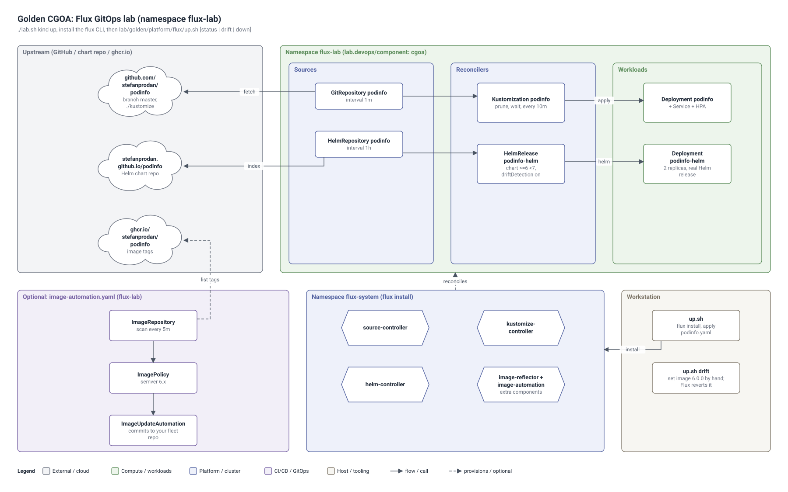
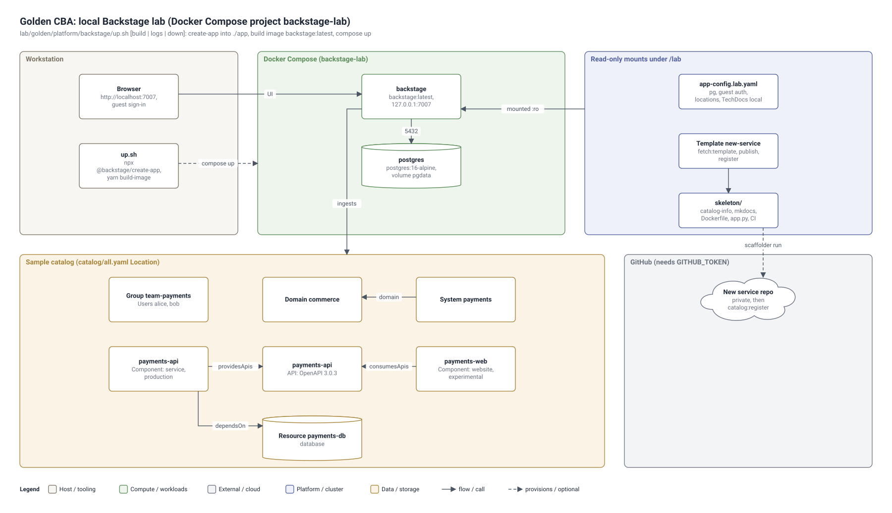
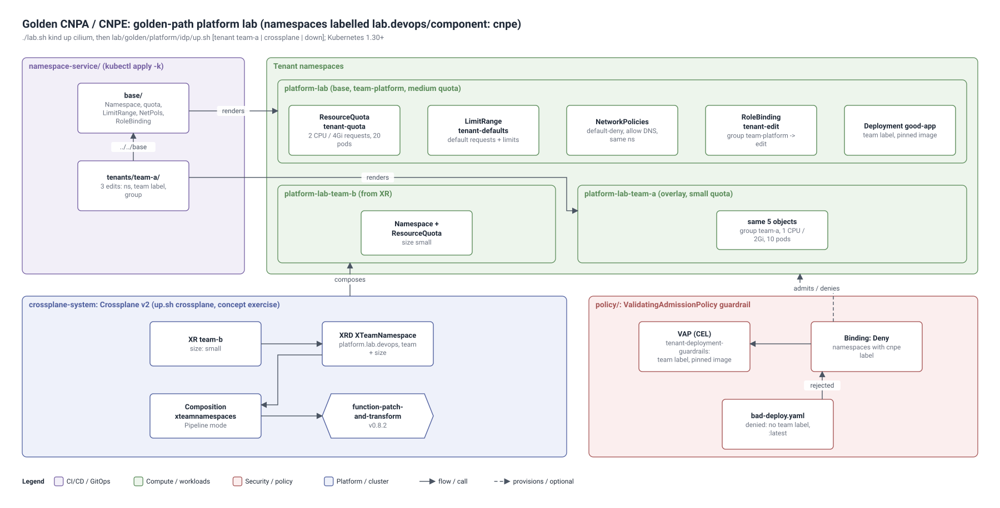

# Golden Kubestronaut: platform labs (phases 26-28)

Three labs for the GitOps, Backstage and platform engineering exams. Each lab has its own namespace (label
`lab.devops/component`), so you can remove one with a single `kubectl delete ns`. Every script shows its usage in its header.

## Architecture







Editable source: `lab/architecture/golden-flux.drawio`, `lab/architecture/golden-backstage.drawio`, `lab/architecture/golden-idp.drawio` (open in draw.io / diagrams.net; File > Export as > VSDX gives a Visio file).


| Dir | Phase / exam | Namespace | Start |
|---|---|---|---|
| `flux/` | 26 - CGOA | `flux-lab` (`cgoa`) | `./lab.sh kind up`, install the flux CLI, `flux/up.sh` |
| `backstage/` | 27 - CBA | none (runs on Docker); `backstage-lab` is reserved for k8s manifests (`cba`) | `backstage/up.sh` |
| `idp/` | 28 - CNPA / CNPE | `platform-lab` (`cnpe`) + tenant overlays `platform-lab-<team>` | `./lab.sh kind up cilium`, `idp/up.sh` |

## flux/ - GitOps with Flux (CGOA)
- `podinfo.yaml` - Namespace + GitRepository + Kustomization (podinfo `./kustomize`) + HelmRepository + HelmRelease (`podinfo-helm`).
- `image-automation.yaml` - optional ImageRepository/ImagePolicy/ImageUpdateAutomation; needs `flux bootstrap --read-write-key` to your own repo.
- `up.sh [up|status|drift|down]` - `drift` edits the Deployment by hand and shows Flux reverting it.
```bash
flux get all -n flux-lab
flux trace deployment podinfo -n flux-lab
helm -n flux-lab list                     # the HelmRelease is a real Helm release
```

## backstage/ - local Backstage (CBA)
- `docker-compose.yaml` - PostgreSQL 16 + a Backstage image you build from `npx @backstage/create-app` (`up.sh` creates it in `./app`, which `backstage/.gitignore` keeps out of Git).
- `app-config.lab.yaml` - lab overrides: Postgres, guest sign-in, catalog locations, local TechDocs. Mounted read-only; `docker compose restart backstage` after edits.
- `catalog/` - sample catalog: `all.yaml` (Location) -> `group.yaml` (Group `team-payments` + 2 Users), `system.yaml` (Domain `commerce`,
  System `payments`, Resource `payments-db`), `api-payments.yaml` (OpenAPI), `component-payments-api.yaml`, `component-payments-web.yaml`.
- `templates/new-service/` - scaffolder template (golden path) + `skeleton/` (catalog-info.yaml, TechDocs, Dockerfile, app.py, CI workflow).
  Dry-run it at http://localhost:7007/create/edit; a real run needs `GITHUB_TOKEN` exported before `up.sh`.
- Needs Node.js 20/22 + corepack, Docker, about 6 GiB RAM. TechDocs in the container needs mkdocs: uncomment the mkdocs lines in `app/packages/backend/Dockerfile` and `./up.sh build`.

## idp/ - golden-path platform exercise (CNPA/CNPE)
- `namespace-service/base/` - Kustomize "namespace as a service": Namespace + ResourceQuota + LimitRange + default-deny NetworkPolicy
  (+ allow DNS, allow same namespace) + RoleBinding (group `team-platform` -> ClusterRole `edit`). Renders ns `platform-lab`.
- `namespace-service/tenants/team-a/` - tenant overlay (ns `platform-lab-team-a`, small quota, group `team-a`). Onboarding = copy + 3 edits.
- `policy/` - ValidatingAdmissionPolicy (team label + pinned images) with `bad-deploy.yaml` / `good-deploy.yaml` to test it.
- `crossplane/` - **concept exercise**: Crossplane v2 XRD + Composition (function pipeline) + XR for a self-service `XTeamNamespace` API.
  Read it first; `idp/up.sh crossplane` installs Crossplane with Helm and runs it for real. Check docs.crossplane.io for current versions.
```bash
kubectl kustomize idp/namespace-service/tenants/team-a     # preview what a tenant gets
idp/up.sh                                                  # base + policy + smoke test
idp/up.sh tenant team-a
idp/up.sh down                                             # deletes all namespaces labelled lab.devops/component=cnpe
```

## Clean up
```bash
flux/up.sh down ; backstage/up.sh down ; idp/up.sh down
flux uninstall --keep-namespace                              # remove Flux controllers
helm -n crossplane-system uninstall crossplane               # remove Crossplane
```
Study guides: `study-guides/26-cgoa-gitops.md`, `27-cba-backstage.md`, `28-cnpa-cnpe-platform.md`.
